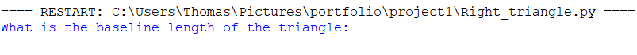
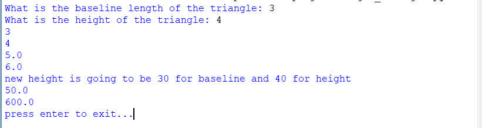
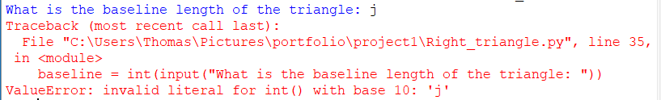

[Back to Portfolio](./)


===============

-   **Class: Applied Networking** 
-   **Grade: A** 
-   **Language(s): Python** 
-   **Source Code Repository:** [features/mastering-markdown](https://github.com/TWHamiltonJR/Right-Triangle)  
    (Please [email me](mailto:twhamilton@csustudent.net?subject=GitHub%20Access) to request access.)

## Project description

This python script sends an email to the designated address through the email provided.

## How to compile and run the program

How to compile (if applicable) and run the project.

```bash
cd ./project
python newsmtp.py
```

## UI Design

Almost every program requires user interaction, even command-line programs. Include in this section the tasks the user can complete and what the program does. You don't need to include how it works here; that information may go in the project description or in an additional section, depending on its significance.


  
Fig 1. The launch screen

  
Fig 2. Example output after input is processed.

  
Fig 3. Feedback when an error occurs.

## 3. Additional Considerations


For more details see [GitHub Flavored Markdown](https://guides.github.com/features/mastering-markdown/).

[Back to Portfolio](./)
