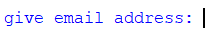
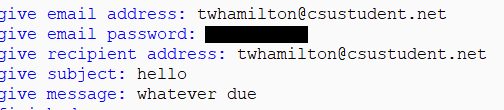
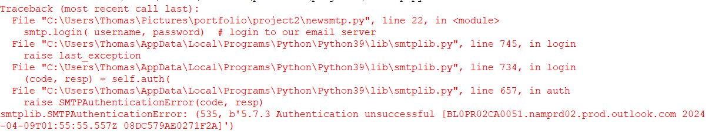

[Back to Portfolio](./)


===============

-   **Class: Applied Networking** 
-   **Grade: A** 
-   **Language(s): Python** 
-   **Source Code Repository:** [Source Repository](https://github.com/TWHamiltonJR/Email-Messaging/tree/main)    
    (Please [email me](mailto:twhamilton@csustudent.net?subject=GitHub%20Access) to request access.)

## Project description

This python script sends an email to the designated address through the email provided.

## How to compile and run the program

How to compile (if applicable) and run the project.

```bash
cd ./project
python newsmtp.py
```

## UI Design

Almost every program requires user interaction, even command-line programs. Include in this section the tasks the user can complete and what the program does. You don't need to include how it works here; that information may go in the project description or in an additional section, depending on its significance.


  
Fig 1. The launch screen It asks you for the username (the source email address) and the password. It then asks you for the password, the recipient email, the subject of the email, and the message of the email.

  
Fig 2. Example output after input is processed.
It then at the end will tell you that it is finished to alert you that it is done.
  
Fig 3. Feedback when an error occurs.
This happens when either the username or password is incorrect.
## 3. Additional Considerations


For more details see [GitHub Flavored Markdown](https://guides.github.com/features/mastering-markdown/).

[Back to Portfolio](./)
