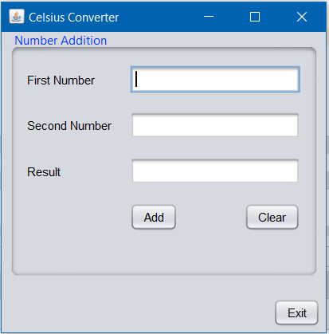
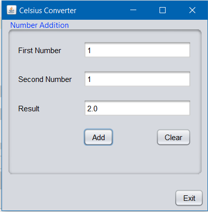
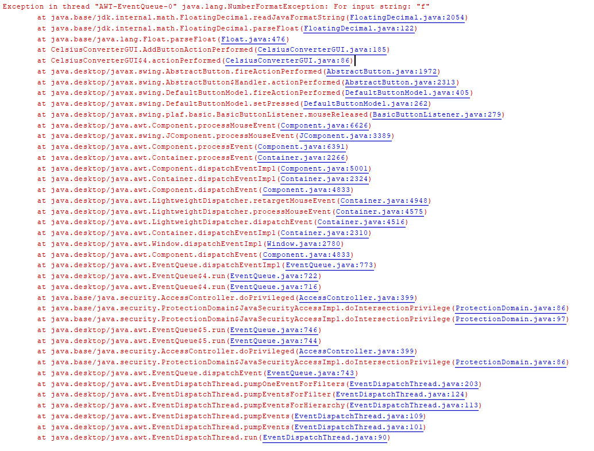

[Back to Portfolio](./)


===============

-   **Class: Object-Oriented Programming** 
-   **Grade: B+** 
-   **Language(s): Java** 
-   **Source Code Repository:** [Source Repository](https://github.com/TWHamiltonJR/Calculator)    
    (Please [email me](mailto:twhamilton@csustudent.net?subject=GitHub%20Access) to request access.)

## Project description

This java file asks the user to input two numbers in two separate gui fields and then the user must press the calculate button which then calculates it.

## How to compile and run the program

How to compile (if applicable) and run the project.

```bash
download jar file from repository
run jar file
```

## UI Design

Almost every program requires user interaction, even command-line programs. Include in this section the tasks the user can complete and what the program does. You don't need to include how it works here; that information may go in the project description or in an additional section, depending on its significance.


  
Fig 1. The launch screen shows the GUI with all blank fields.

  
Fig 2. Example output after input is processed.
After inputting the numbers and clicking add it adds them and outputs the answer in the appropriate field.
  
Fig 3. Feedback when an error occurs.
This error occurs when you try to input a non numerical number. This shows only on the terminal side and will allow the user to try again until a number is entered.

[Back to Portfolio](./)
