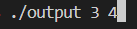
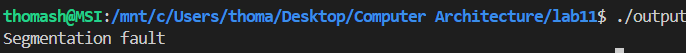

[Back to Portfolio](./)


===============

-   **Class: Computer Architecture** 
-   **Grade: In class presently** 
-   **Language(s): Assembly** 
-   **Source Code Repository:** [Source Repository](https://github.com/TWHamiltonJR/Assembly_Calculator)    
    (Please [email me](mailto:twhamilton@csustudent.net?subject=GitHub%20Access) to request access.)

## Project description

This assembly file asks the user to input two numbers and it will add them together.

## How to compile and run the program

How to compile (if applicable) and run the project.

```bash
cd ../project4
./output [number1] [number2]
```

## UI Design

Almost every program requires user interaction, even command-line programs. Include in this section the tasks the user can complete and what the program does. You don't need to include how it works here; that information may go in the project description or in an additional section, depending on its significance.


  
Fig 1. The launch screen which is just the terminal about to execute the program with the numbers 3 and 4 inputted.

  
Fig 2. Example output after input is processed.
It shows that the sum of the 2 numbers is 7 correctly.
  
Fig 3. Feedback when an error occurs.
This error occurs when you do not put in two numbers. If you put in a non numerical value it defaults that number to 0.
## 3. Additional Considerations


For more details see [GitHub Flavored Markdown](https://guides.github.com/features/mastering-markdown/).

[Back to Portfolio](./)
